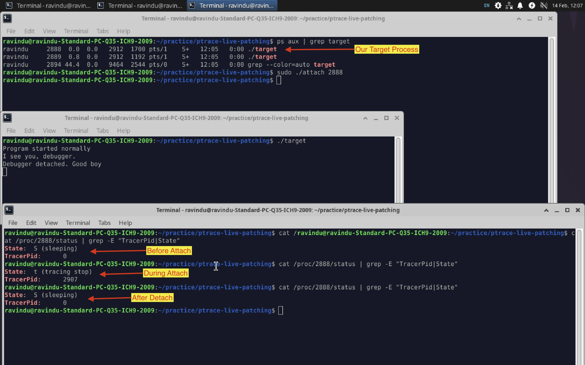

# ptrace Attach Behaviour Analysis

1. When `ptrace(PTRACE_ATTACH, pid, ...)` is called, the Linux kernel sends a `SIGSTOP` signal to the target process automatically.

2. The target process enters a **stopped state** (State: `T`) and pauses execution.

3. The tracer process must call `waitpid(pid, ...)` to wait until the target process is fully stopped.

4. `waitpid()` is required for synchronization. It ensures the tracer does not access registers or memory before the process is safely paused.

5. After `waitpid()` returns, the tracer can safely:

   * Read or modify registers
   * Read or write memory
   * Set breakpoints
   * Control execution

6. The stopped process will not continue execution until the tracer calls `ptrace(PTRACE_CONT, ...)` or similar control commands.

7. If the target process has multiple threads, `PTRACE_ATTACH` only attaches to one thread. Other threads must be attached separately.

8. While attached, `/proc/<pid>/status` will show:

   * `State: T (stopped)`
   * `TracerPid: <tracer_pid>`

## Appendix

