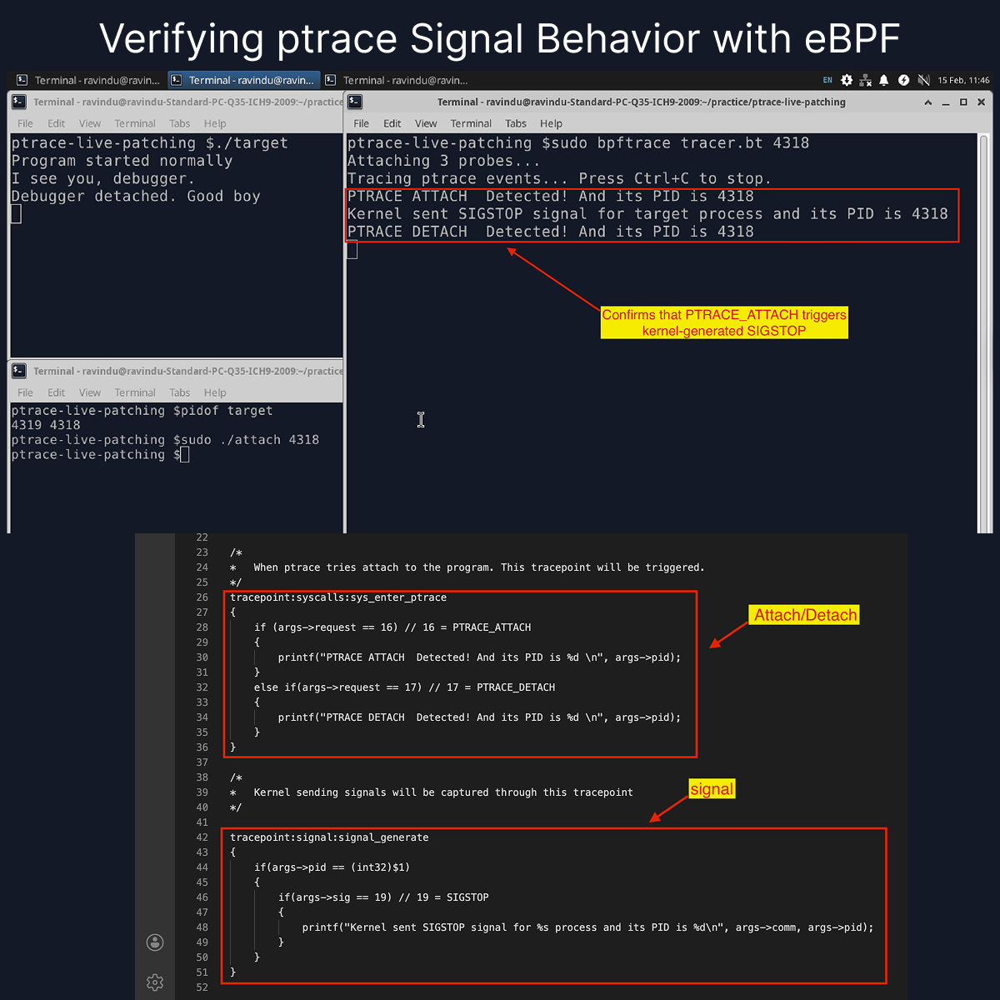

# signal_observer.bt – Kernel-Level ptrace Behavior Tracer

This eBPF-based tracer was developed to experimentally verify signal behavior during `PTRACE_ATTACH`.

The script:

* Hooks `tracepoint:syscalls:sys_enter_ptrace`
* Hooks `tracepoint:signal:signal_generate`
* Filters by target PID
* Detects ATTACH (16), DETACH (17)
* Confirms kernel-generated `SIGSTOP` (19)

Purpose:

To observe and document actual kernel behavior instead of assuming documented flow.

This lab forms part of the ptrace deep-dive series focused on:

* Debugger mechanics
* Signal lifecycle
* Process state transitions
* Kernel observability using eBPF

---